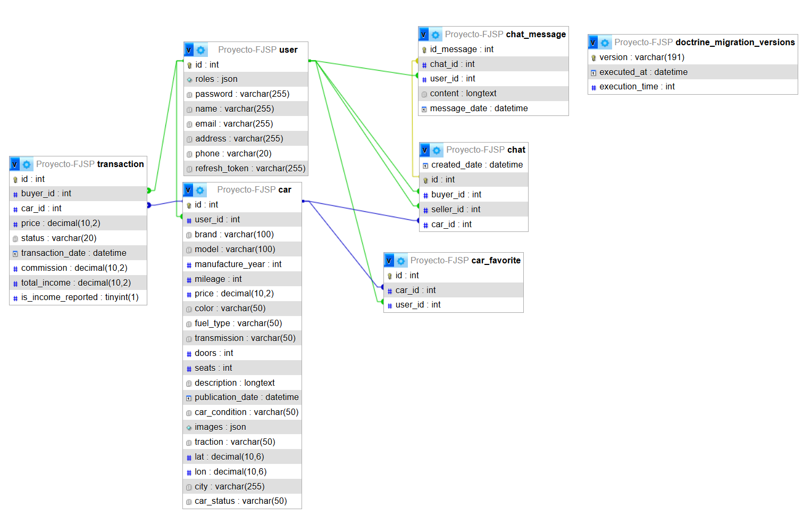

# 🚗 RenovAuto - Página Web de Coches

Bienvenido a **RenovAuto**, un proyecto personal que nace de mi pasión por el mundo automovilístico y el desarrollo web. Esta plataforma está pensada para ofrecer a los usuarios una experiencia clara y atractiva para explorar coches y venderlos, ya sea por interés, consulta o futura compra.

## 🎯 ¿Por qué este proyecto?

Desde hace tiempo me interesa el diseño de sitios web funcionales y visualmente agradables, y decidí unir ese interés con otra de mis pasiones: los coches. Así nació esta página, con el objetivo de:

- Practicar y mejorar mis habilidades de desarrollo web.
- Crear una plataforma orientada al usuario, simple pero efectiva.
- Simular un catálogo real de coches, como lo haría una concesionaria o marketplace.

## 🧰 Tecnologías utilizadas

- **JavaScript / Tailwind** - Para la estructura, interaccion y el diseño visual.
- **Symfony** - Para gestionar las peticiones del fronted.
- **Nginx** - Para la visualizacion de la pagina e interacion y funcionalidad de la misma.
- **MySQL** - Para el alamacenamiento de datos
- **PhpMyAdmin** - Para la gestion y visualizacion de los datos, la base de datos y relaciones.
- **RailWay** - Para el despliegue en produccion de la pagina web
- **DockerDesktop** - Para el despliegue local y dockerizacion del proyecto.

## 💡 Funcionalidades principales

- Listado de coches con imagen, marca, modelo y precio.
- Filtros por tipo, marca o rango de precios.
- Página de detalles individuales para cada coche.
- Diseño responsive adaptado a móviles y tablets.

## Diagrama E/R



## 🚀 Despliegue

### Clonar repositorio

```bash

git clone https://github.com/FranSalmeron/ProyectoDaw.git
cd ProyectoDaw

```

### 🚀 Cómo levantar el proyecto con Docker en local

### Imagenes de docker

- Backend: http://hub.docker.com/repository/docker/fransalmeron/proyectodaw-backend/general
- Frontend: https://hub.docker.com/repository/docker/fransalmeron/proyectodaw-frontend/general
- Nginx: https://hub.docker.com/repository/docker/fransalmeron/proyectodaw-nginx/general
- MySQL: https://hub.docker.com/repository/docker/fransalmeron/proyectodaw-mysql/general
- PhpMyAdmin: https://hub.docker.com/repository/docker/fransalmeron/proyectodaw-phpmyadmin/general

### DOCKERFILES

- Los dockerfiles que tienen el nombre por defecto son para railway y despliegue en produccion, aquellos con el nombre del servicio Backend, Frontend e iniciales son para el despliegue local, si no simplemente cambiarlo en el dockerCompose.

Este proyecto usa Docker para facilitar el despliegue local. Para levantar todos los servicios, ejecuta en la carpeta donde se encuentra el docker compose:

```bash
docker compose up -d
```
## 🚀 Despliegue en producción con Railway

Este proyecto usa Railway para gestionar el despliegue de cada servicio Dockerizado.

Cada contenedor se construye automáticamente desde los Dockerfiles en las carpetas:

- `/frontend`
- `/backend`
- `/nginx`
- `/database` (si aplica)

Railway expone cada servicio en rutas específicas (por ejemplo, `/backend`, `/nginx`) y gestiona el proxy inverso para que funcionen juntos como una sola app.

### Para desplegar en produccion (RailWay)

1. Conecta tu repositorio con Railway.
2. Cada push a GitHub reconstruirá y desplegará los servicios automáticamente.
3. Para cada servicio poner la ruta correcta como carpeta root del servicio ejemplo backend: /backend en railWay
4. Para la base de datos crear un servicio el que prefieras, MySQL, PostgreSQL, y coger la url interna de red de railway en el apartado variables y ponerla y enlazar el backend a esta
5. Para enlazar el backend y frontend de la misma manera, poner la url y por si acaso el puerto del servicio backend interno de la red al frontend
6. IMPORTANTE, railway utilizara los dockerfile que se llaman exactamente asi, si se cambia el nombre no lo usuara y aparte estos ya vienen modificados para que funcionen.

Para más información, visita [Railway Docs](https://docs.railway.app/).

## Conclusiones y dificultades


Gracias por visitar este repositorio. Si tienes sugerencias o quieres colaborar, ¡estaré encantado de escucharte!

